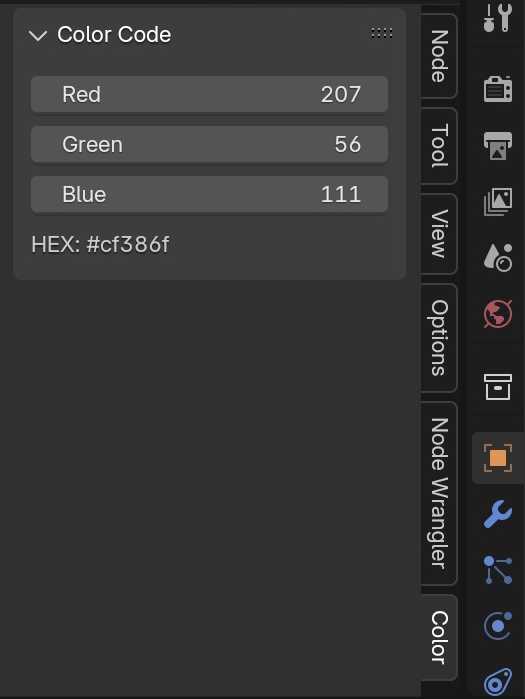

Color Code Conversion - RGB to HEX color code conversion add-on for Blender.

### Supported Versions

Blender Version 2.8 or higher

### How to install

1. Download Color Code Conversion 1.0 (color_code_conversion.py)
2. Open Preferences > Add-ons category.
3. Install the download file using Install Add-ons.
